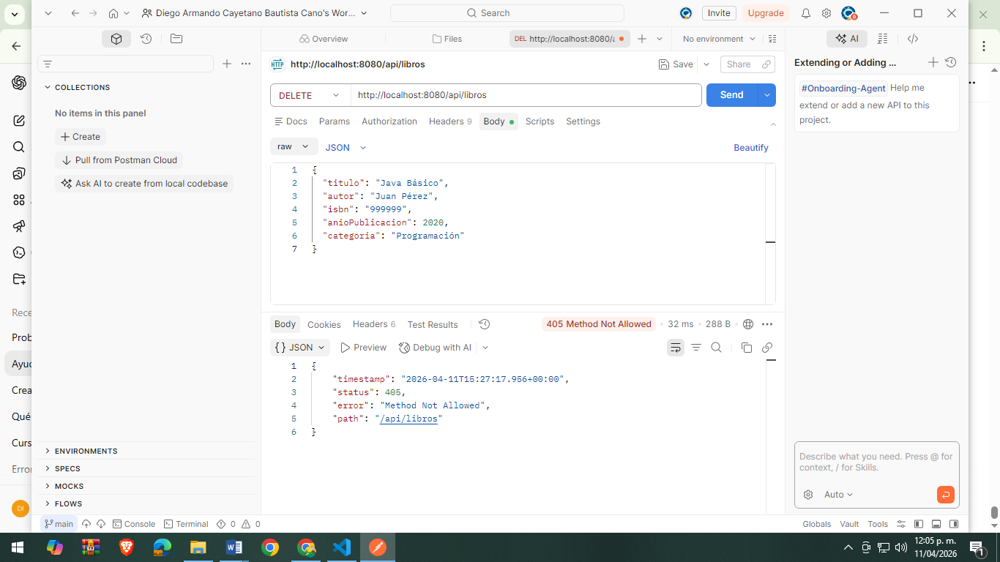
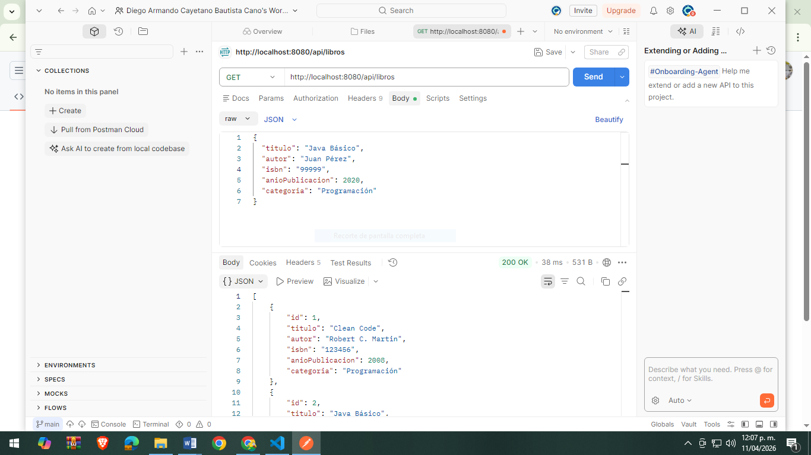
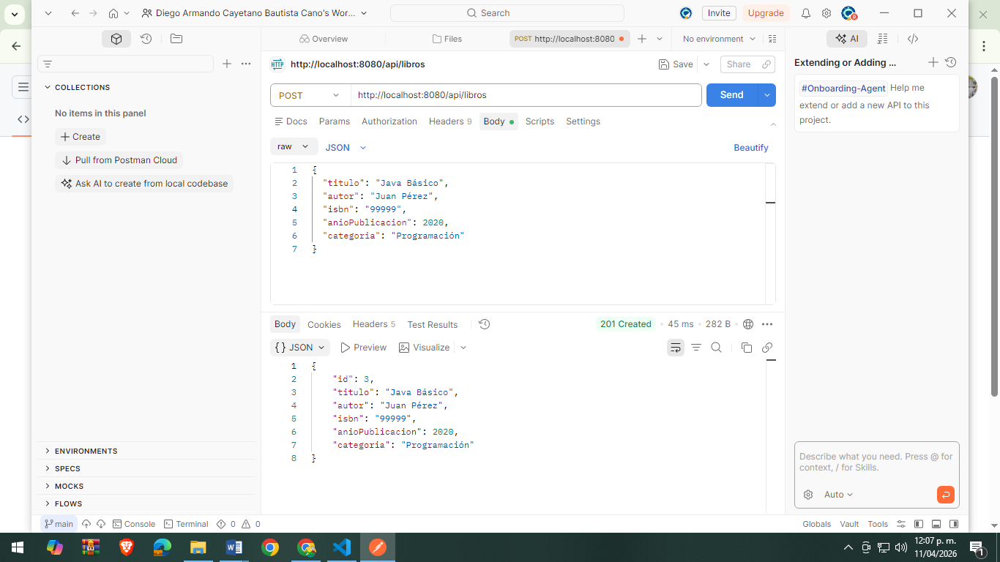
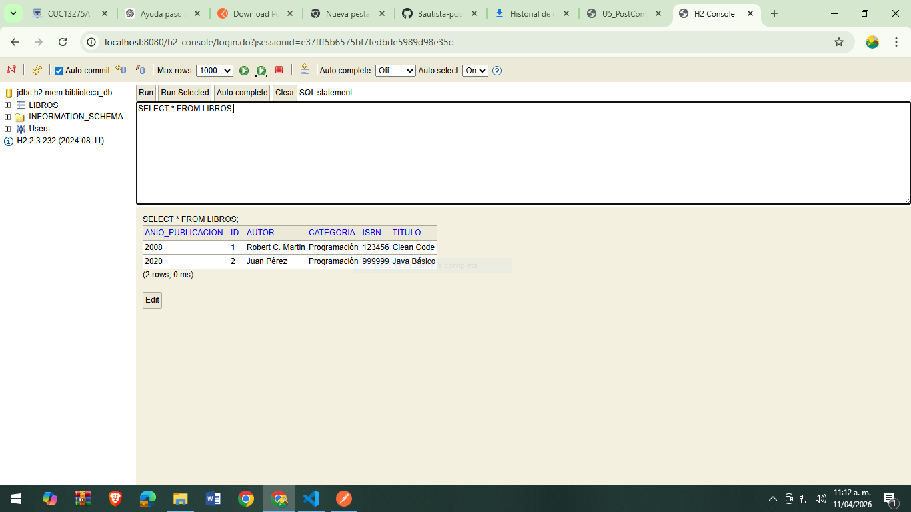

# 📚 Biblioteca API

API REST desarrollada con Spring Boot para la gestión de libros en una biblioteca.

## 🚀 Tecnologías utilizadas

- Java 17+
- Spring Boot
- Spring Data JPA
- Base de datos H2 (en memoria)
- Maven


## ⚙️ Ejecución del proyecto

1. Clonar el repositorio:
```bash
git clone https://github.com/DiegoArmandoCayetano/Bautista-post1-u5.git
Entrar al proyecto:
cd biblioteca-api
Ejecutar la aplicación:
mvn spring-boot:run
Acceder a:
API: http://localhost:8080
H2 Console: http://localhost:8080/h2-console
🔑 Configuración H2
JDBC URL: jdbc:h2:mem:biblioteca_db
User: sa
Password: (vacío)
📌 Endpoints disponibles

➤ Crear libro
POST /api/libros

➤ Listar libros
GET /api/libros

➤ Buscar libros
GET /api/libros/buscar?q=texto

➤ Eliminar libro
DELETE /api/libros/{id}

EVIDENCIAS

## 🗑️ Eliminar libro (DELETE)


---

## 📥 Obtener libros (GET)


---

## 📤 Crear libro (POST)


---

## 🗄️ Verificación base de datos


🎯 Funcionalidades
Crear libros
Listar libros
Buscar por título
Eliminar libros
Persistencia en base de datos en memoria

👨‍💻 Autor
Proyecto desarrollado por Diego Armando Cayetano.
